# Official Server List

A Fabric mod for Minecraft 26.1.x that integrates https://findmcserver.com (the official Minecraft server list) directly into the multiplayer menu.

***THIS MOD IS NOT AFFILIATED WITH MOJANG OR THE OFFICIAL MINECRAFT SERVER LIST.***

## Features

- Browse the official server list with all the same filters/options as the original website
- Add servers directly to your multiplayer list
- View a servers details
- View a servers upcoming events

## Screenshots

### Multiplayer Menu Integration

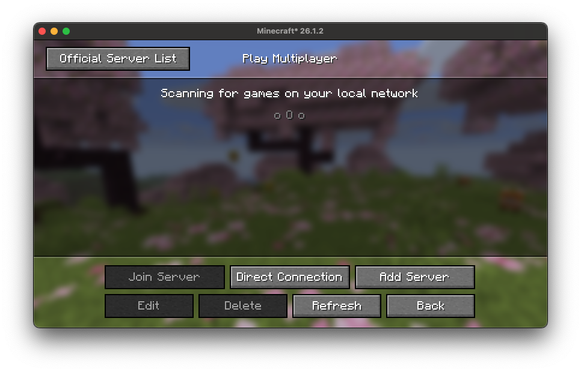

### Server List

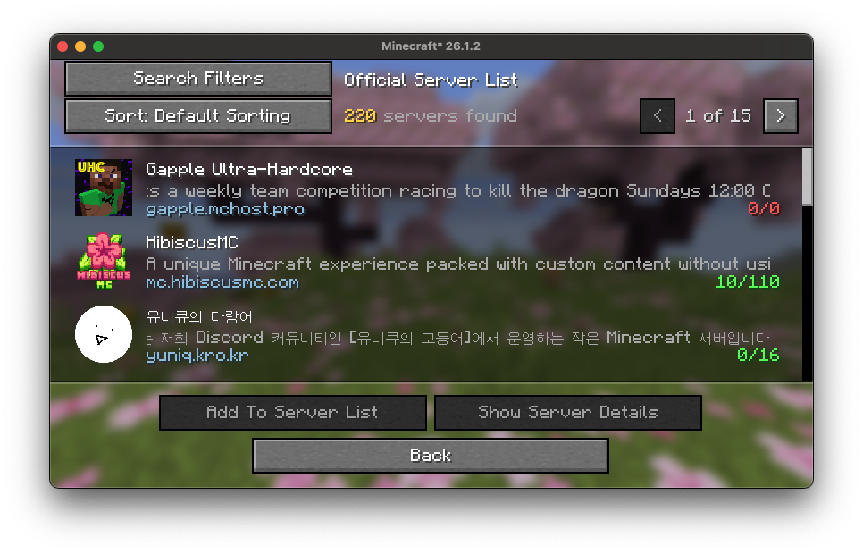

### Filters

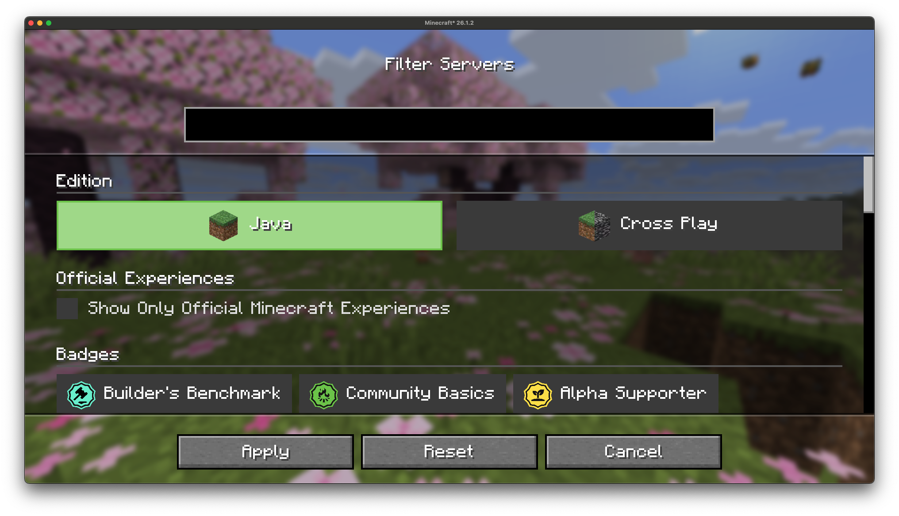

### Sort By

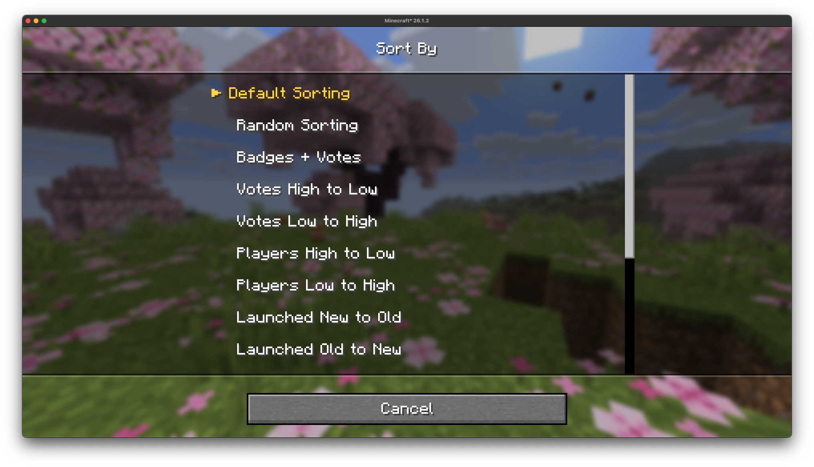

### Server Details

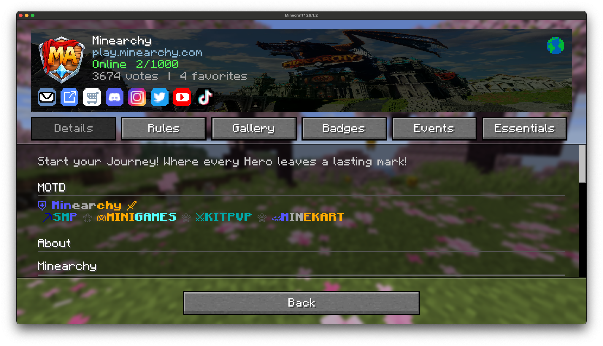

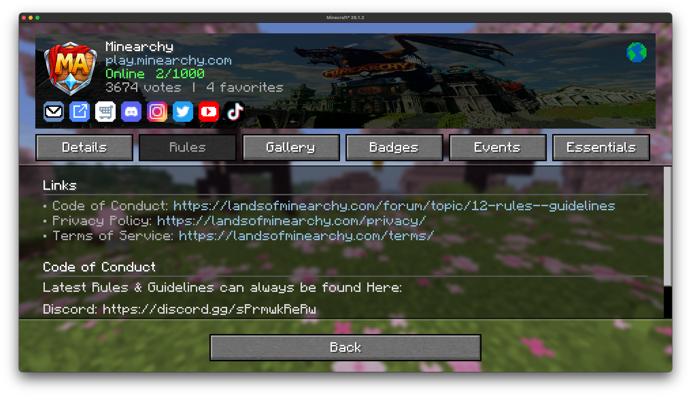

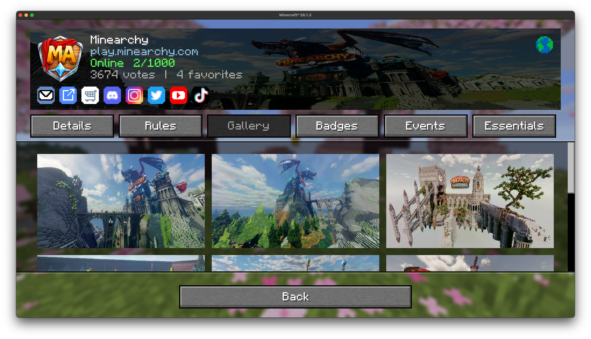

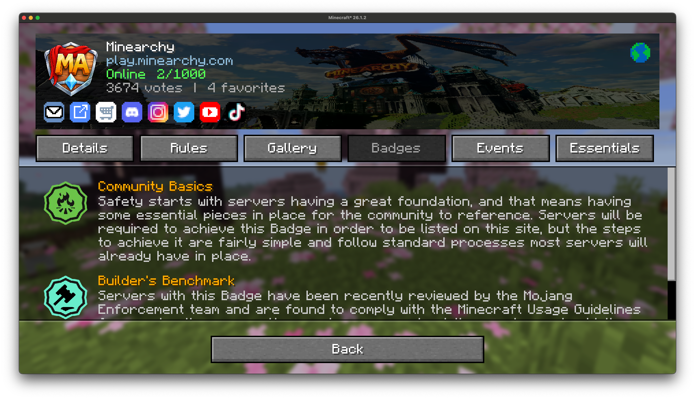

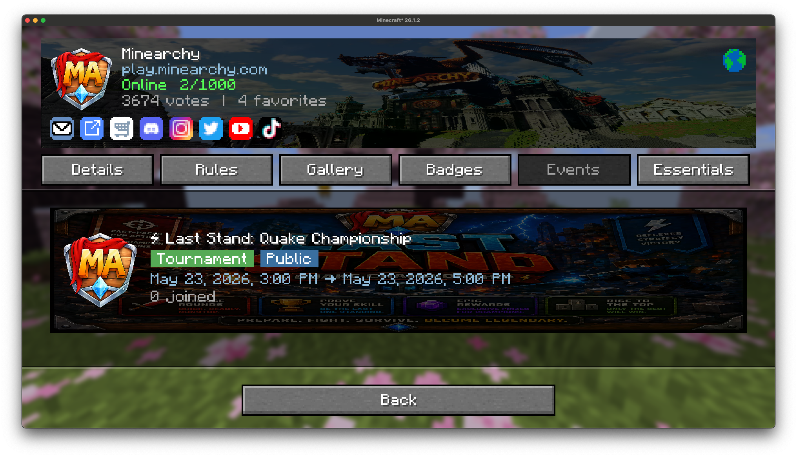

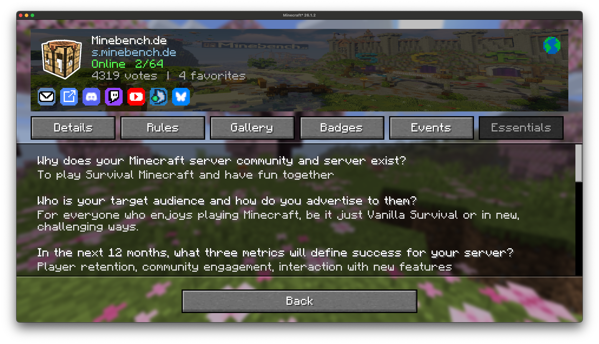

### Event Details

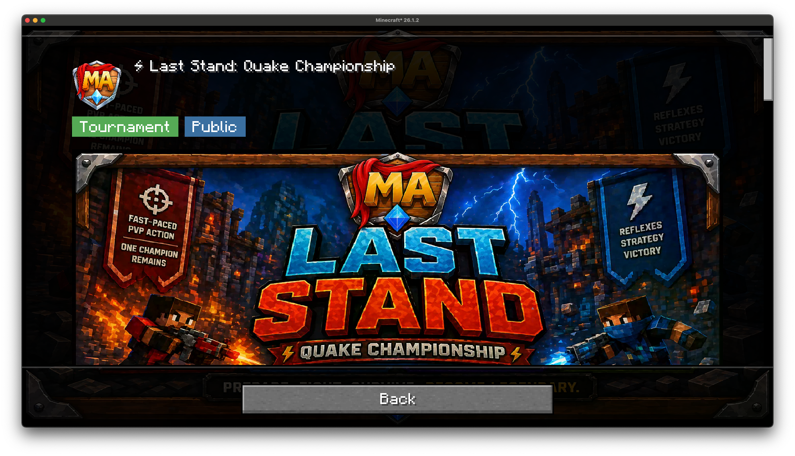

## Disclaimer

This mod is an unofficial integration with findmcserver.com. All server listings, badges, descriptions, and other content are property of their respective server owners and findmcserver.com. We are not responsible for the content of any server listed through the integration.
